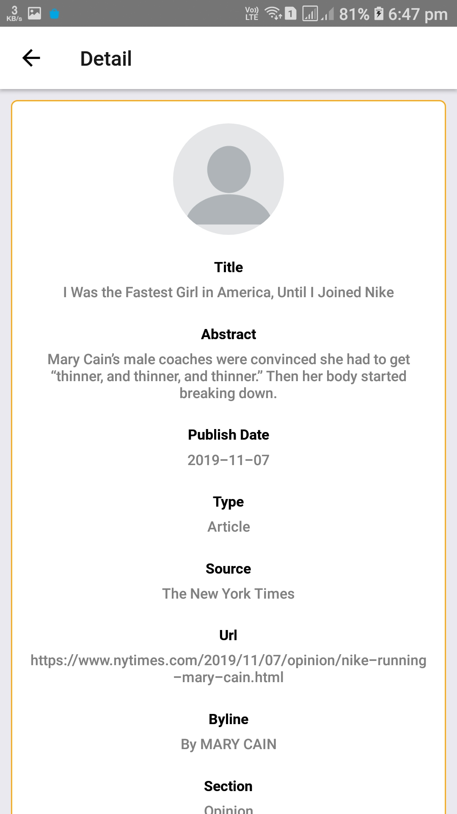
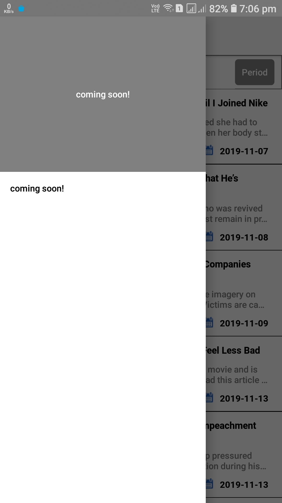
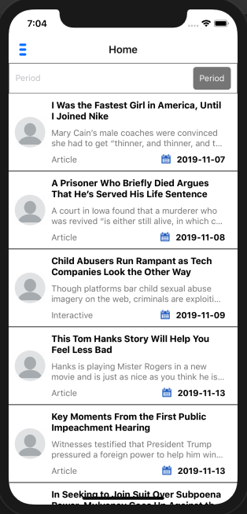
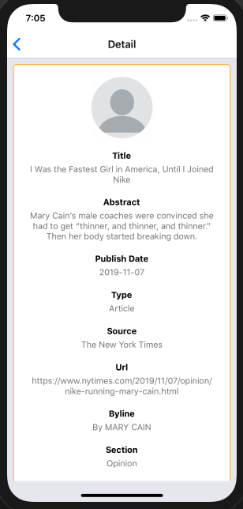
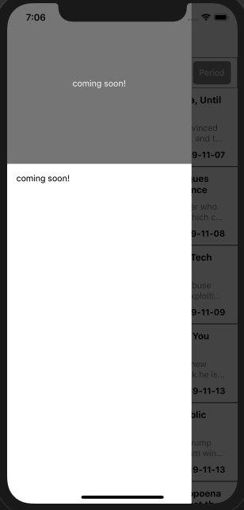

# ReactNativePushnotification
It is a React Native Sample application

## How use this sample application

#Add npm packages 

```
npm install
````

# Run Application on Android

```
react-native run-android
```

# Run Application on IOS

```
react-native run-android
```

#Following features are used for this sample application

- React 16.0.9
- React Native 0.61.4
- React Native flux router
- React Redux
- Redux Thunk
- Redux 
- eslint configuration

## Output Android

- Home Screen


- Detail Screen



- Drawer Screen



## Output IOS

- Home Screen



- Detail Screen



- Drawer Screen


